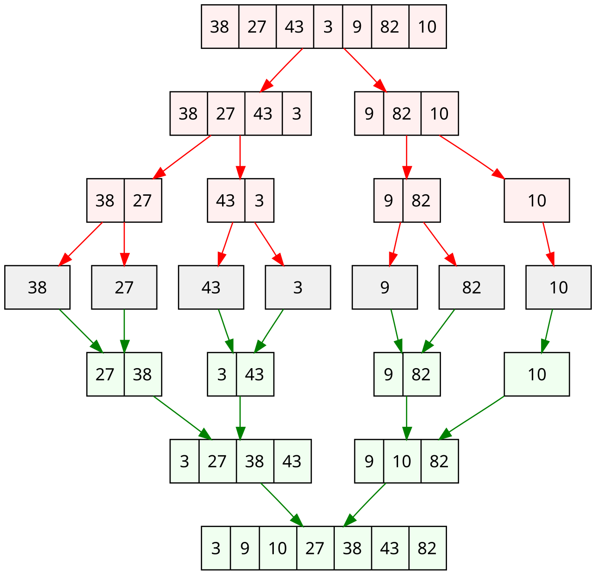

# ParallelAlgoCompendium 📚

This repository showcases three projects aimed at parallelizing algorithms using Pthreads/OpenMP, MPI, and OpenCL.

## Merge Sort 🔀

The focus is on implementing and analyzing the performance of recursive parallel and sequential merge sort algorithms. The parallel version uses the pthread library and OpenMP. Both implementations are written in C, with performance evaluated across different thread counts.

<p align="center">
    
</p>

To test, execute the following command:

```bash
cd merge_sort
make
```

## Sexy Number 🔢

The goal is to parallelize the Sieve of Eratosthenes to find sexy numbers, optimizing workload distribution to minimize memory usage with MPI.

<p align="center">
    
</p>

To test, execute the following command:

```bash
cd sexy_number
make p1 #we only used MPI_send, MPI_get
make p2 #we replaced them with MPI_Put and MPI_send
```

(image from wikipedia)